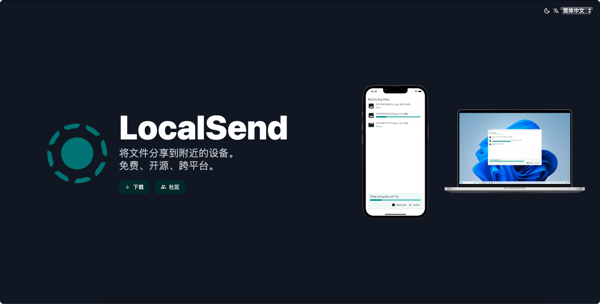

# LocalSend

## Where to find it?

* GitHub: https://github.com/localsend/localsend
* Official Website: https://localsend.org/zh-CN

## Feature

LocalSend 是一个跨平台应用程序，它允许使用 REST API 和 HTTPS 加密在设备间进行安全通信。与其它依赖外部服务器的消息应用程序不同，LocalSend 不需要互联网连接或第三方服务器，是其成为本地通信的快速可靠的解决方案。

* 去中心化：无需中央服务器即可分享文件，文件传输完全点对点。
* 跨平台：支持 Windows、Linux、MacOS、Android 和 iOS。
* 免费：LocalSend 免费使用，无广告、无跟踪、无隐藏付费。
* 开源：源代码公开可用，任何人都可以为项目作出贡献。
* 安全：端到端加密确保只有您和接收者可以访问您的文件。
* 易于使用：无需注册的简单用户界面，其它设备会自动被发现。

## Supported Platform

* Windows
* Linux
* MacOS
* Android
* iOS