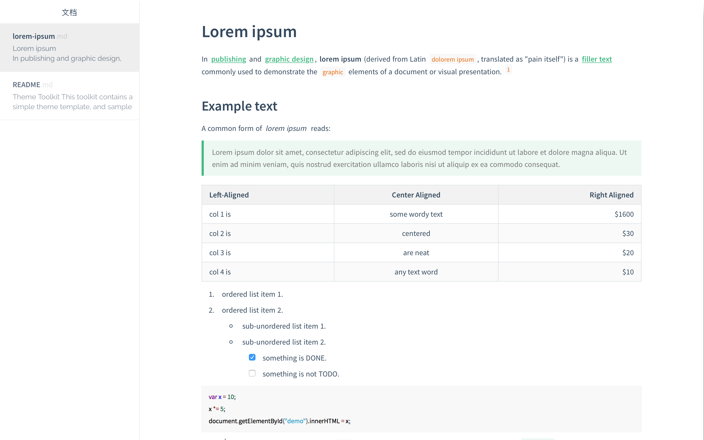

# Treasure Pavilion

> 工欲善其事，必先利其器。这里是开源或个人免费使用软件、资源的汇总，对于这些软件或资源的开发者、维护者或支持个人免费使用的决定，我想说，非常感谢你们。

## Typora Theme

* [Mdmdt](./TyporaTheme/Mdmdt) - Typora 极简文档主题 Mdmdt，包含亮色和暗色两种主题，是深度定制的个性化 Typora 主题。

* [typora-vue-theme](./TyporaTheme/typora-vue-theme) - 一个类似于 Vue 文档风格的 Typora Markdown 编辑器主题。

## Xournal++

Xournal++ (/ˌzɚnl̟ˌplʌsˈplʌs/) 是一款开源、跨平台的笔记软件，快速、灵活、功能强大。是 Xournal 程序的现代重写和功能更丰富的版本。

### Where to find it?

* Github: https://github.com/xournalpp/xournalpp
* Official Website: https://xournalpp.github.io

## LocalSend

将文件分享到附近的设备。免费、开源、跨平台。

### Where to find it?

* GitHub: https://github.com/localsend/localsend
* Official Website: https://localsend.org/zh-CN

### Feature

* 去中心化：无需中央服务器即可分享文件，文件传输完全点对点。
* 跨平台：LocalSend 可用于 Windows、MacOS、Linux、Android 和 iOS。
* 免费：LocalSend 免费使用，无广告、无跟踪、无隐藏付费。
* 开源：源代码公开可用，任何人都可以为项目作出贡献。
* 安全：端到端加密确保只有您和接收者可以访问您的文件。
* 易于使用：无需注册的简单用户界面，其它设备会自动被发现。
