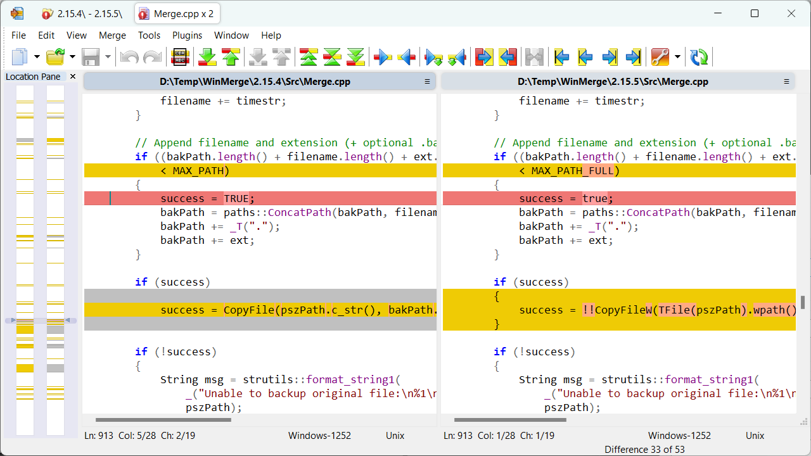

# WinMerge

## Where to find it?

* GitHub: https://github.com/winmerge/winmerge
* Official Website: https://winmerge.org

## Feature

WinMerge is highly useful for determining what has changed between project versions, and then merging changes between versions. WinMerge can be used as an external differencing/merging tool or as a standalone application.

* General
    * Supports Microsoft Windows XP SP3 or newer
    * Handles Windows, Unix and Mac text file formats
    * Unicode support
    * Tabbed interface
* File Compare
    * 3-way File Comparison`New Function`
    * Visual differencing and merging of text files
    * Flexible editor with syntax highlighting, line numbers and word-wrap
    * Highlights differences inside lines
    * Difference pane shows current difference in two vertical panes
    * Location pane shows map of files compared
    * Moved lines detection
* Folder Compare
    * Regular Expression based file filters allow excluding and including items
    * Fast compare using file sizes and dates
    * Compares one folder or includes all subfolders
    * Can show folder compare results in a tree-style view
    * 3-way Folder Comparison
* Image Compare`New Function`
    * Support many types of images
    * Can highlight the differences with blocks
    * Overlaying of the pictures is possible
* Table Compare`New Function`
    * Shows CSV/TSV file contents in table format
    * Text can be wrapped for each column
* Version Control
    * Creates patch files (Normal-, Context- and Unified formats)
    * Resolve conflict files
* Other
    * Shell Integration (supports 64-bit Windows versions)
    * Archive file support using 7-Zip
    * Plugin support
    * Localizable interface
    * [Online manual](https://manual.winmerge.org/en/) and installed HTML Help manual

## WinMerge 2.16.46 - latest stable version

[WinMerge 2.16.46](https://winmerge.org/downloads/?lang=en) is the latest stable version, and is recommended for most users.